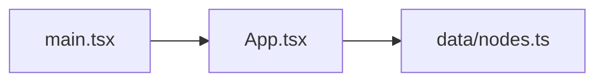

# Azure DevOps Setup — KnowledgeNetworkThesisDemo

Goal: use Azure DevOps for (1) a **wiki with clickable Mermaid** diagrams and
(2) **Boards** to plan tickets as features — while the **code stays on GitHub**.

---

## 0. Prereqs
- [ ] A Microsoft account (free). The Azure DevOps free tier (Basic plan, up to 5 users + unlimited Stakeholders) is plenty for solo use.

## 1. Create the organization + project
1. [ ] Go to https://dev.azure.com and sign in.
2. [ ] **New organization** → give it a name → pick a hosting region near you → **Continue**.
   - Your home URL becomes `https://dev.azure.com/<org>`.
   - (Org creation is web-only — there's no API for it.)
3. [ ] **New project** → name it `KnowledgeNetworkThesisDemo` → **Version control: Git** → **Visibility: Private** → **Create**.
4. [ ] You land on the project. Left nav = the hubs: **Boards, Repos, Pipelines, Wiki**. Hide ones you won't use under **Project settings → Overview**.

## 2. First win — Wiki + clickable Mermaid
1. [ ] Left nav → **Wiki** → **Create project wiki**. (This "provisioned" wiki is itself a git repo, so a pipeline can push to it later.)
2. [ ] **New page** → name it `Architecture`.
3. [ ] Paste this and **Save**. Note **`graph`, not `flowchart`** — ADO's Mermaid build requires it:

````

````

4. [ ] Confirm it renders **and** the nodes are clickable (the capability you verified at work) — each should open the file on GitHub.
   - ⚠️ Those links 404 until you **push your current code** to GitHub. Your live app (App.tsx, data/nodes.ts) is still uncommitted, so do the commit/push first.

## 3. Boards — plan tickets as features
Work-item hierarchy (Agile process): **Epic → Feature → User Story / Task**.
1. [ ] **Boards → Work items → New → Feature**: create one Feature per ROADMAP milestone (M1 Neo4j graph model … M7 Presentation preview).
2. [ ] Open each Feature → add **child Tasks** for the slices inside it.
3. [ ] **Boards → Boards**: drag cards across columns (New → Active → Resolved → Closed).
4. [ ] (Optional) **Boards → Sprints** to practice iterations.

## 4. Link GitHub so tickets track against code
1. [ ] **Project settings → GitHub connections** → connect → authorize the **Azure Boards app for GitHub** → **Add repositories** → pick `alwaysmiddle/KnowledgeNetworkThesisDemo`.
2. [ ] Reference work items from commits/PRs with **`AB#<id>`** — exact, no space (`AB# 12` and `AB #12` don't work).
   - e.g. commit message: `Add pptx import AB#12`
   - `Fixes AB#12` (or "Closes/Resolves") auto-transitions the work item to done when merged.

## 5. Later — automate the wiki diagram
- An **Azure Pipeline** (can build directly from your GitHub repo) runs your `npm run map`-style generator and pushes the Mermaid into the wiki repo on each merge.
- Discipline to keep: the **deterministic generator stays the source of truth**; let an AI agent add grouping/narration on top — never let the AI be the structural source of truth, or the diagram drifts.

## Gotchas
- Mermaid on ADO: use `graph`; most HTML tags and some syntax (`flowchart`, long arrows, Font Awesome) are unsupported; keep each diagram **scoped/small** (Mermaid struggles with large graphs).
- The wiki view is **post-merge/lagging** by design — that's fine for documentation, not a live instrument.
