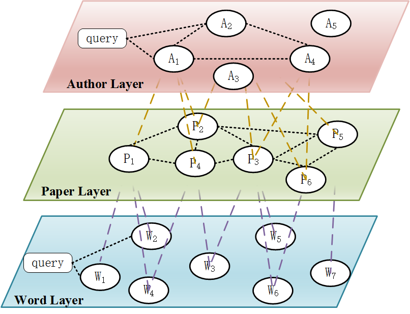

# Multi-Layer Knowledge Graph Navigation

## Overview

A demonstration of layered navigation through a knowledge graph. Each layer represents a category of nodes (e.g., Departments, Professors, Courses, Students) connected by hierarchical relationships.

### Example Domain: School System

```
Departments
    │ has_faculty / member_of_faculty
    ▼
Professors
    │ teaches / taught_by
    ▼
Courses
    │ enrolled_by / enrolled_in
    ▼
Students
```

Each relationship pair is bidirectional (inverse semantics).

---

## Core Concept

Traditional knowledge graphs display all nodes and edges on a flat 2D canvas. This feature introduces **layered 2D navigation**:

- **One layer visible at a time** - Each layer is a complete 2D graph of nodes of the same type
- **Smooth zoom transition** - Clicking a node zooms into its children on the next layer
- **Filtered view** - Only the clicked node's direct children are shown (not the entire next layer)
- **Bidirectional navigation** - Drill down into children OR drill up to parents

---

## User Experience

### Navigation Flow

```
┌─────────────────────────────────────────────────────────┐
│  DEPARTMENT LAYER                                       │
│                                                         │
│     ┌──────────┐      ┌──────────┐      ┌──────────┐   │
│     │   CS     │──────│   Math   │──────│ Physics  │   │
│     └────┬─────┘      └──────────┘      └──────────┘   │
│          │                                              │
│     [Click CS]                                          │
└──────────┼──────────────────────────────────────────────┘
           │
           ▼  (zoom animation)
┌─────────────────────────────────────────────────────────┐
│  PROFESSOR LAYER (filtered: CS Department only)         │
│  ← Back to Departments                                  │
│                                                         │
│     ┌──────────┐      ┌──────────┐      ┌──────────┐   │
│     │ Prof. A  │──────│ Prof. B  │──────│ Prof. C  │   │
│     └────┬─────┘      └──────────┘      └──────────┘   │
│          │                                              │
│     [Click Prof. A]                                     │
└──────────┼──────────────────────────────────────────────┘
           │
           ▼  (zoom animation)
┌─────────────────────────────────────────────────────────┐
│  COURSE LAYER (filtered: Prof. A's courses only)        │
│  ← Back to Professors                                   │
│                                                         │
│     ┌──────────┐      ┌──────────┐                     │
│     │  CS 101  │──────│  CS 201  │                     │
│     └──────────┘      └──────────┘                     │
└─────────────────────────────────────────────────────────┘
```

### Interaction Design

**Clicking a Node:**
1. Node highlights (visual feedback)
2. Context menu or tooltip appears with options:
   - "Drill Down" → Show this node's children on the next layer
   - "Drill Up" → Show this node's parent on the previous layer
   - (If at top layer, "Drill Up" is disabled)
   - (If at bottom layer or no children, "Drill Down" is disabled)
3. Selecting an option triggers smooth zoom animation
4. New layer appears with filtered nodes

**Animation:**
- Current layer zooms into the clicked node (scale up + fade out)
- Next layer fades in from the center (scale up from small)
- Duration: ~300-500ms
- Easing: ease-out for natural feel

**Breadcrumb Trail:**
```
Departments > CS > Prof. A > [Current: Courses]
```
- Clickable breadcrumbs for quick navigation back
- Shows the filter path taken

---

## Visual Design

### Single Layer View

```
┌─────────────────────────────────────────────────────────┐
│ ┌─────────────────────────────────────────────────────┐ │
│ │ Breadcrumb: Departments > CS                        │ │
│ └─────────────────────────────────────────────────────┘ │
│                                                         │
│ ┌─────────────────────────────────────────────────────┐ │
│ │                                                     │ │
│ │            ○ Prof. A                                │ │
│ │           ╱ ╲                                       │ │
│ │          ╱   ╲                                      │ │
│ │    ○ Prof. B ── ○ Prof. C                          │ │
│ │                                                     │ │
│ │    [2D force-directed or circular layout]          │ │
│ │                                                     │ │
│ └─────────────────────────────────────────────────────┘ │
│                                                         │
│ ┌─────────────────────────────────────────────────────┐ │
│ │ Layer: Professors (3 nodes) │ ← Back │ Context: CS  │ │
│ └─────────────────────────────────────────────────────┘ │
└─────────────────────────────────────────────────────────┘
```

### Node Interaction States

| State | Visual |
|-------|--------|
| Default | Colored circle with label |
| Hover | Slight scale up, glow effect |
| Selected | Ring highlight, context menu visible |
| Has Children | Small indicator (▼ or badge) |
| No Children | No indicator |

---

## Data Model

### Layer Definition

```typescript
interface Layer {
  id: string
  name: string           // e.g., "Departments", "Professors"
  nodeType: string       // Type of nodes in this layer
  nodes: Node[]          // All nodes of this type
  intraLayerEdges: Edge[] // Connections within this layer
}
```

### Cross-Layer Relationship

```typescript
interface LayerRelationship {
  fromLayer: string      // e.g., "departments"
  toLayer: string        // e.g., "professors"
  relationship: string   // e.g., "has_faculty"
  inverseRelationship: string // e.g., "member_of_faculty"
}
```

### Navigation State

```typescript
interface NavigationState {
  currentLayerIndex: number
  filterPath: FilterStep[]  // The path of clicked nodes
  visibleNodes: Node[]      // Filtered nodes for current layer
}

interface FilterStep {
  layerIndex: number
  nodeId: string
  nodeLabel: string
}
```

---

## Implementation Phases

### Phase 1: Core Navigation (MVP)
- [ ] Fixed layer hierarchy (hardcoded school system)
- [ ] Single layer 2D view with force-directed layout
- [ ] Click node → context menu with drill down/up options
- [ ] Smooth zoom animation between layers
- [ ] Breadcrumb navigation
- [ ] Filter to children only when drilling down
- [ ] Back button to return to parent layer

### Phase 2: User Configuration
- [ ] User-defined relationship chain builder
- [ ] Dynamic layer construction from chain
- [ ] Save/load layer configurations

### Phase 3: Enhancements
- [ ] Mini-map showing all layers (like reference image) as overview
- [ ] Search within current layer
- [ ] Highlight path from root to current node
- [ ] Animation customization (speed, style)

---

## Open Questions

1. **Intra-layer edges**: Should nodes within the same layer be connected? (e.g., Prof A collaborates with Prof B)
   - Current assumption: Yes, show relationships between nodes of same type

2. **Empty layers**: What happens if a node has no children?
   - Show message: "No [child type] found for [node name]"

3. **Multiple parents**: If drilling up, and a node has multiple parents, which one to show?
   - Option A: Show all parents on the previous layer
   - Option B: Show the parent from the current filter path only

---

## Reference



*Note: While the reference shows a 3D stacked view, our implementation uses a single-layer view with animated transitions between layers.*
