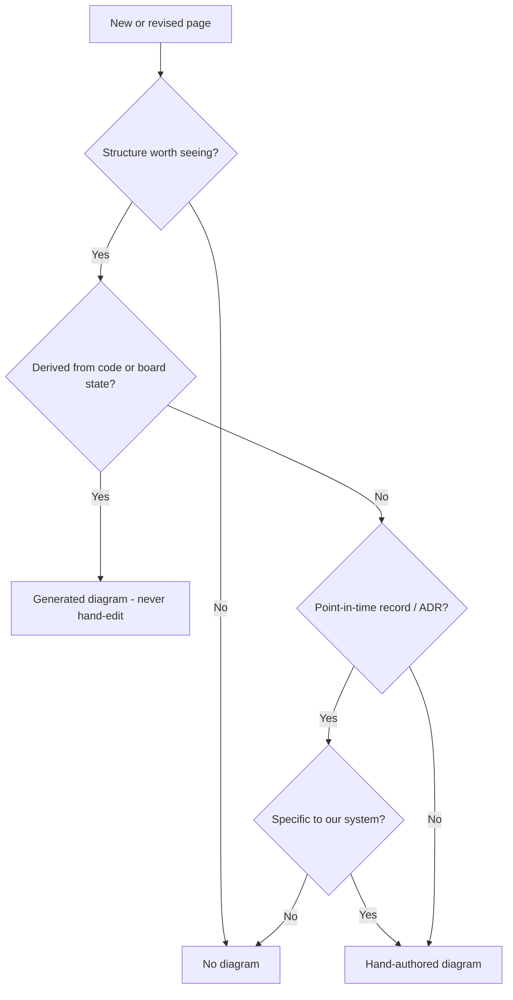

# Document Types and Diagram Policy

This page defines how the wiki classifies its own documents and decides which
visual — if any — each one carries.

It exists so the wiki stays honest to the [Vision](Vision): text and graph are
two views of one knowledge base. That means we do **not** decorate pages that
have no structure worth showing, and we do **not** hand-author diagrams on pages
whose source of truth is code or board state (those drift — the exact problem we
are solving).

Established 2026-06-25 from a scoping discussion. This is a convention, not an
ADR; revise it in place as the policy matures.

---

## Governing Principle

A page earns a diagram only when **both** are true:

1. **It has structure worth seeing** — a graph, a workflow, a set of states, or
   a set of competing options. Prose-only and pure-navigation pages do not.
2. **The diagram's authorship matches the page's source of truth** —
   hand-authored for stable concepts; generated for anything derived from code
   or board state. A generated diagram is never hand-edited.

If a diagram would show something *any engineer already knows* rather than
something *specific to this system*, leave it out.

---

## Two Classifying Axes

Every wiki page sits on two axes, and the pair decides the visual:

- **Authorship of the visual** — hand-authored concept / generated-from-source / none.
- **Temporal nature** — stable concept / point-in-time record / living-derived.

---

## The Decision Flow

---

## Document Types

The full pipeline from raw problem to working code:

**Problem → Ideas (sketch + research per idea, iterative) → Decision → Spec → Build**

| Type | Example pages | Nature | Diagram verdict | Mermaid kind |
|------|---------------|--------|-----------------|--------------|
| Problem | `problems/*` | Ephemeral→stable | None | — |
| Idea | `ideas/*` | Living (iterative) | None | — |
| Decision | `decisions/*` | Point-in-time | Conditional | `flowchart` / before→after |
| Feature spec | `specs/001-…`, `specs/002-…` | Per-slice | Yes — per-spec delta | `classDiagram` / `stateDiagram` |
| Domain model | `specs/System-Model.md` | Stable concept | Yes | `classDiagram` / graph |
| Requirements / scope | `requirements/MVP-Scope.md` | Stable-ish | Yes | `flowchart` (workflow) |
| Vision / narrative | `Vision.md` | Stable concept | Yes | `flowchart` (the loop) |
| Roadmap / status | `Roadmap.md` | Living | Text now, diagram later | `gantt` / `stateDiagram` |
| Generated architecture | `architecture/Architecture.md` | Living-derived | Yes — generated | `flowchart` via `npm run map` |
| Navigation diagram | `Home.md` pipeline map | Living | Yes — hand-authored now, generated later | `flowchart` |
| Convention / meta | `Feature-Spec-Convention`, this page | Stable | Optional | `flowchart` if a process |
| Index / navigation | section `*.md` index pages | Living | None | — |
| Working state | `progress/Project-Context` | Ephemeral | None | — |

---

## Standing Rulings

**ADRs — conditional on the decision.**
An ADR (Architecture Decision Record) captures one significant design decision
at the moment it is made: context, decision, options considered, consequences.
ADRs are append-only — a new decision supersedes an old ADR rather than
rewriting it — so any diagram on one is a *snapshot*, not a living view. Give an
ADR a diagram only when the decision is **specific to this system** (e.g. our
ADO ↔ GitHub ↔ wiki wiring, or a before→after of a scope pivot). If the decision
just applies **general industry knowledge**, no diagram.

**Roadmap — text-only while in flux.**
The roadmap changes constantly at this stage, so it stays tables for now.
Diagrams get added on later revisions, once decisions cement. The eventual goal
is to generate the status view from board state rather than hand-keep it.

**Feature specs — per-spec slice diagram.**
Each feature spec carries its own diagram showing the model **as of that slice**,
highlighting the nodes and edges the slice introduces. The architecture is
therefore a series of versioned deltas — one per spec — not a single frozen
picture. This matches the skeleton-first principle: each slice extends the
skeleton and shows exactly what it added.

---

## Mermaid Kind by Structure — Quick Reference

- Domain / data model → `classDiagram` or a `graph`.
- Workflow, loop, or pipeline → `flowchart`.
- Status or UI states → `stateDiagram`.
- Timeline or plan → `gantt` / `timeline`.
- Dependency graph (generated) → `flowchart` from `npm run map`.

--