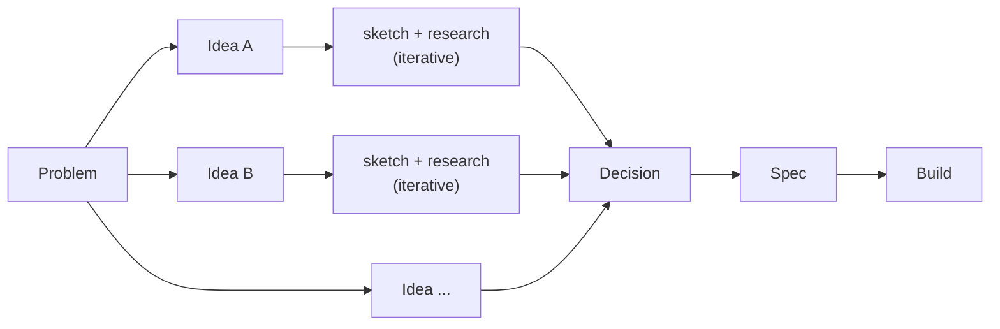

# KnowledgeNetworkThesisDemo Wiki

The living knowledge base for this project. All design documents, specs, decisions, and progress tracking live here.

Code repository: [alwaysmiddle/KnowledgeNetworkThesisDemo](https://github.com/alwaysmiddle/KnowledgeNetworkThesisDemo)

---

## Pipeline

Each problem generates a collection of ideas. Each idea is developed iteratively — sketch and research evolve together inside the idea document. A decision then compares across ideas (pick one, combine parts, or reject all) and feeds into a spec.

---

## Sections

| Stage | Section | Purpose |
|-------|---------|---------|
| Problem | [Problems](problems/problems) | Well-defined problems. Entry point to everything. |
| Idea | [Ideas](ideas/ideas) | Candidate solutions. Each contains its sketch and research. |
| Decision | [Decisions](decisions/decisions) | What was chosen from the ideas and why. |
| Spec | [Specs](specs/specs) | Build-ready feature contracts and system model. |

## Reference

| Section | Purpose |
|---------|---------|
| [Vision](Vision) | Target SDLC infrastructure and why we are building it this way. |
| [Document Types and Diagrams](Document-Types-and-Diagrams) | How each