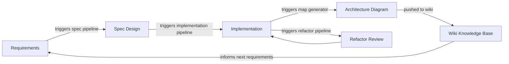

# Vision: SDLC as a Connected Knowledge Infrastructure

## What We Are Building

A skeleton software development lifecycle (SDLC) infrastructure — built on Azure DevOps — where every phase produces structured knowledge, and that knowledge is automatically linked, visualized, and kept current by pipeline triggers.

This thesis demo is the **first prototype** of that infrastructure. The patterns we prove here become the reusable template for the real KnowledgeNetwork project.

---

## The Core Idea

Each phase of development produces artifacts (requirements, specs, code, diagrams). Today those artifacts live in disconnected places and drift from each other. The goal is to make them **one unified knowledge base** where:

- Text and graph are two views of the same information.
- Phase transitions are pipeline-triggered, not manual hand-offs.
- The wiki is always derivable from the code — never manually maintained.

---

## The SDLC Loop

### Phase Descriptions

**Requirements**
Captured in ADO Wiki pages. Each requirement links to the ADO Board work item that tracks it. Requirements are the entry point for the loop.

**Spec Design**
Feature spec files in `wiki/specs/`. A pipeline run can validate that each Board item in "Active" state has a corresponding spec file, and fail if not. This is the gate before implementation begins.

**Implementation**
Code committed to GitHub. Pipeline builds, tests, and lints on each PR. Merge to `master` is the trigger for the next phase.

**Architecture Diagram**
`npm run map` generates a Mermaid diagram from the live code. A pipeline step runs this on merge and pushes the result to the ADO wiki. The diagram is always current because it is generated — never hand-authored.

**Refactor Review**
A periodic pipeline (or PR gate) that checks code health metrics — complexity, coverage, dead code — and opens a Board item if thresholds are crossed. Closes the loop back to requirements.

**Wiki Knowledge Base**
ADO Wiki holds the authoritative text: requirements, decisions, rationale, and generated diagrams. It is the human-readable surface of the system. The code is the machine-readable surface. Together they are the knowledge graph.

---

## Two Layers of the Knowledge Base

| Layer | Medium | Tooling | Source of Truth |
|-------|--------|---------|-----------------|
| Textual | Wiki pages, ADRs, specs | ADO Wiki (Markdown) | Human-authored |
| Graphical | Architecture diagrams | Mermaid (rendered in ADO Wiki) | Generated from code |

The graphical layer is **always generated**. The textual layer is **human-authored but pipeline-validated**. Neither layer is the AI's job to maintain structurally — AI adds narration and grouping on top of a deterministic base.

---

## Why ADO Wiki + Mermaid as the First Prototype

ADO Wiki natively renders Mermaid, supports clickable nodes (linking to GitHub file URLs), and is backed by a Git repo that pipelines can push to. This gives us:

- Graphical knowledge (Mermaid) living inside textual knowledge (wiki pages).
- A pipeline-writable knowledge store.
- No extra tooling to set up.

This is the minimum viable unified knowledge base. Later iterations can add richer graph rendering, semantic linking, or query interfaces — but the structural pattern stays the same.

---

## Skeleton-First Principle

We build the infrastructure skeleton before filling it in. Each SDLC phase gets its minimal pipeline hook first (even if it just logs). The demo product (PPTX → knowledge nodes) runs through this skeleton. When the skeleton is proved, we carry the pattern forward to the real project.

---

## Connection to KnowledgeNetwork

The real KnowledgeNetwork project is itself a system for managing knowledge as a graph. This thesis demo makes the argument concretely: the development process of a knowledge network system should itself be a knowledge network. The SDLC infrastructure *is* the first knowledge graph we build.
